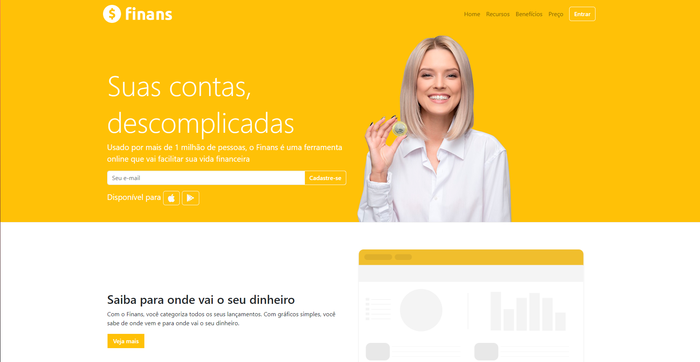

<h1 align="center"> Projeto Finans </h1>

Projeto frontend focado em HTML, CSS e Bootstrap.  

  <a href="#-tecnologias">Tecnologias</a>&nbsp;&nbsp;&nbsp;|&nbsp;&nbsp;&nbsp;
  <a href="#-projeto">Projeto</a>&nbsp;&nbsp;&nbsp;|&nbsp;&nbsp;&nbsp;
  <a href="#-layout">Layout</a>&nbsp;&nbsp;&nbsp;|&nbsp;&nbsp;&nbsp;
  <a href="#memo-licença">Licença</a>

  

 

  

## 🚀 Tecnologias

Esse projeto foi desenvolvido com as seguintes tecnologias:

- HTML e CSS
- Bootstrap
- Git e Github

## 💻 Projeto

O projeto foi feito para treinar minhas habilidades com HTML, CSS e Bootstrap.

- [Visite o projeto online](https://gustavoabarbosa.github.io/Finans/)

Obrigado pelo acesso!